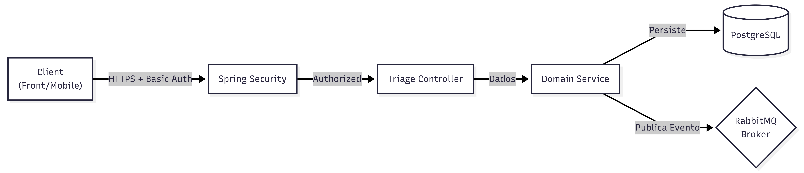

# 🧠 Prioritas - Backend Core API

O Backend Core é o cérebro do ecossistema Prioritas. Ele é responsável por gerenciar o ciclo de vida da triagem médica, persistir os dados clínicos e atuar como Event Producer, notificando outros microsserviços sobre situações de risco.

## 🏛️ Arquitetura e Responsabilidades

Este serviço expõe uma API REST segura e segue os princípios de Clean Architecture e Event-Driven Design.

- API REST: Recebe dados vitais e sintomas.
- Engine de Regras: Calcula automaticamente o nível de risco (EMERGENCY, URGENT, STANDARD).
- Persistência: Salva o histórico clínico no PostgreSQL.
- Mensageria: Publica eventos de triagem na fila prioritas.triage.queue (RabbitMQ).



## 🛠️ Stack Tecnológica
- Linguagem: Kotlin 1.9
- Framework: Spring Boot 3.4
- JDK (Runtime): Java 17 (LTS), Toolchain configurado via `jvmToolchain(17)`
- Database: PostgreSQL 18 (via Spring Data JPA)
- Security: Spring Security (Basic Auth)
- Documentation: Springdoc OpenAPI (Swagger UI)
- Mensageria: Spring AMQP

## 🔐 Segurança e Autenticação

A API é protegida por Basic Authentication. Para realizar requisições de escrita (POST), é necessário enviar o cabeçalho Authorization.

| Role | Username | Password | Permissões |
| :--- | :--- | :--- | :--- |
| **TRIAGE** | `nurse` | `nurse` | Criar novas triagens (`POST /triages`) |
| **ADMIN** | `admin` | `admin` | Acesso total e Actuator |

** Nota: Endpoints de documentação (/swagger-ui/**, /v3/api-docs) são públicos para facilitar a homologação.**

## 🔌 API Endpoints

A documentação interativa completa está disponível em:👉 http://localhost:8080/swagger-ui.html

Principais Recursos

1. Realizar Triagem
   POST /triages
   Calcula o risco baseado nos sinais vitais e salva o registro.
   Payload Exemplo (Emergência):

```json
{
"patientId": "3fa85f64-5717-4562-b3fc-2c963f66afa6",
"vitalSigns": {
    "hasChestPain": true,
    "temperature": 37.5,
    "heartRate": 120,
    "oxygenSaturation": 96,
    "systolicPressure": 160,
    "diastolicPressure": 100
    }
}
```

Resposta (201 Created):

```json
{
"id": "7a37a59f-5009-4c74-ae49-e0b7415db263",
"riskLevel": "EMERGENCY",
"riskColor": "RED",
"assessedAt": "2026-02-07T18:00:00"
}
```

## ⚙️ Configuração (Environment Variables)

O serviço é configurado para rodar em containers Docker. As variáveis abaixo são injetadas automaticamente pelo `docker-compose.yml`.

| Variável | Descrição | Valor Padrão (Dev) |
| :--- | :--- | :--- |
| **Banco de Dados** | | |
| `SPRING_DATASOURCE_URL` | Connection String JDBC | `jdbc:postgresql://backend-db:5432/prioritas` |
| `SPRING_DATASOURCE_USERNAME` | Usuário do Banco | `postgres` |
| `SPRING_DATASOURCE_PASSWORD` | Senha do Banco | `postgres` |
| `SPRING_DATASOURCE_DRIVER` | Driver do banco | `org.postgresql.Driver` |
| **Mensageria** | | |
| `SPRING_RABBITMQ_HOST` | Host do Broker | `rabbitmq` |
| `SPRING_RABBITMQ_PORT` | Porta AMQP | `5672` |

##🚦 Regras de Negócio (Cálculo de Risco)

A lógica de triagem segue protocolos de prioridade baseados em sinais vitais críticos.
1. 🔴 EMERGENCY (Vermelho):
    - Dor no peito (hasChestPain = true).
    - Saturação de O2 < 90%.
    - Batimentos > 140 bpm ou < 40 bpm.
2. 🟡 URGENT (Amarelo):
    - Febre alta (> 39°C).
    - Pressão Arterial elevada (Sistólica > 180).
3. 🔵 STANDARD (Azul):
    - Demais casos com sinais vitais estáveis.

## 🚀 Como Rodar

**Via Docker Compose (Recomendado)**

A partir da raiz do projeto (prioritas-project/), execute:

```bash
docker compose up --build -d
```

O serviço aguardará o banco de dados (service_healthy) e o RabbitMQ iniciarem antes de subir na porta 8080.

**Via Gradle (Local)**

Para rodar fora do Docker, você precisará de um Postgres e RabbitMQ rodando localmente.

```bash
# Sobrescreva as variáveis se rodar fora do container
export SPRING_RABBITMQ_HOST=localhost
export SPRING_DATASOURCE_URL=jdbc:postgresql://localhost:5432/prioritas

./gradlew :prioritas:bootRun
```

## 📦 Eventos Publicados

Sempre que uma triagem é concluída, um evento é disparado para integração assíncrona.

Exchange: (default)Queue: prioritas.triage.queuePayload: TriageNotificationEvent (Definido no módulo :common).